# hse_hw2_chip
[Ссылка на Colab](https://colab.research.google.com/drive/1nxFtCML0Kb04q11izihl_LUKWsUYKxxw?usp=sharing)

|   |   |
|---|---|
Клеточная линия | H1
Гистоновая метка | H4K20me1
ID эксперимента | [ENCSR728SZE](https://www.encodeproject.org/experiments/ENCSR728SZE/)
ID Реплики 1 | ENCFF387MHG
ID Реплики 2 | ENCFF449SLH
ID контроля | ENCFF003YFN
Хромосома выравнивания | chr22
ID bed Peak | ENCFF718VCC
Версия | ENCODE3 GRCh38

## Анализ FastQC
HTML-отчёт представлен:
|ENCFF387MHG|ENCFF449SLH|ENCFF003YFN|
|---|---|---|
|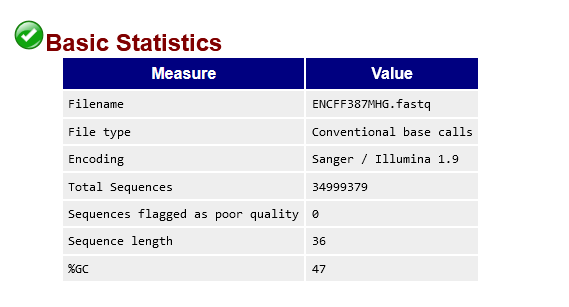|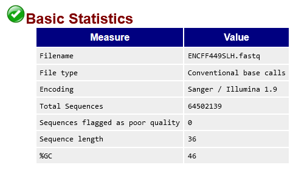|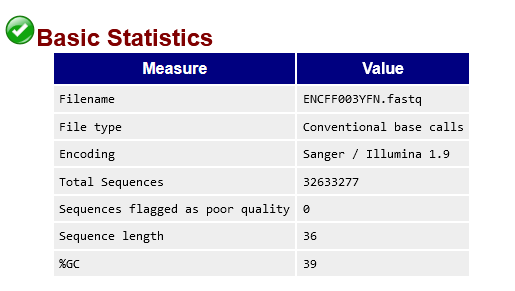|
|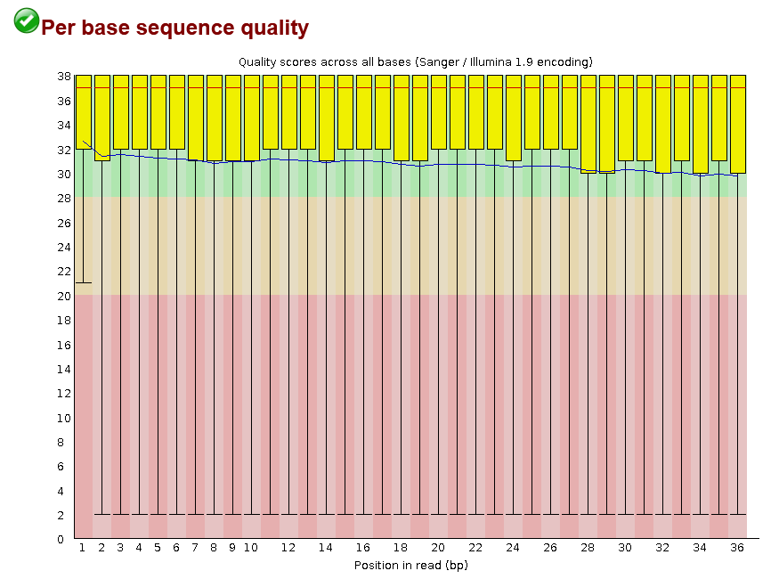|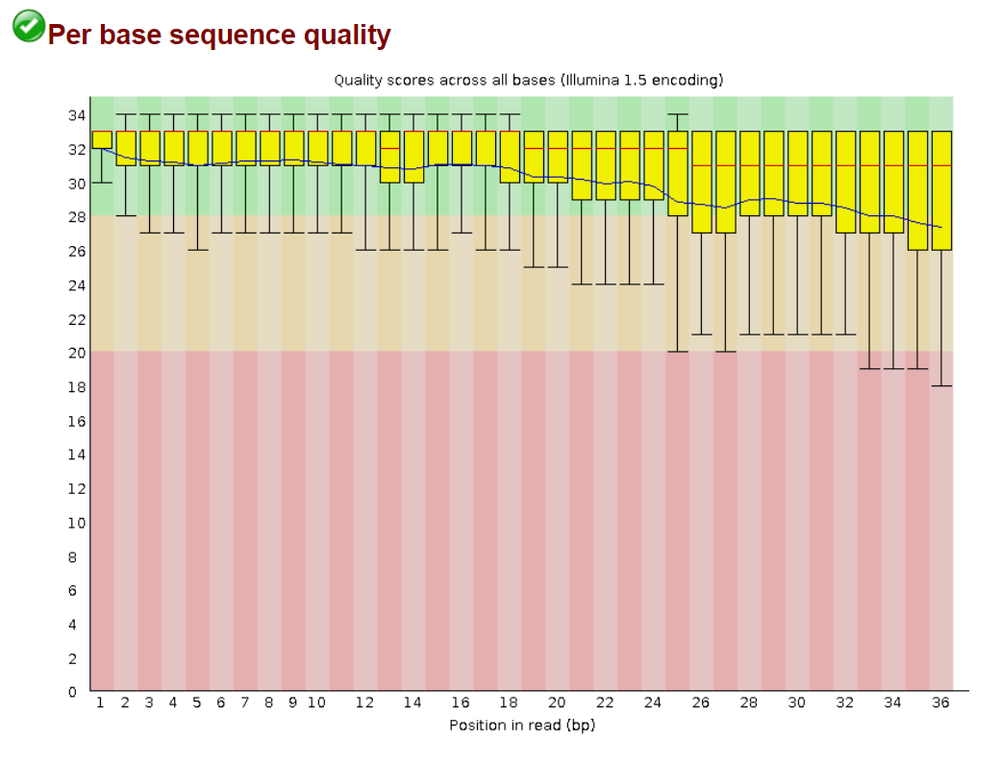|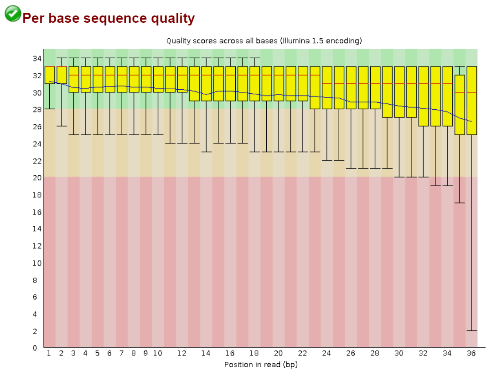|
|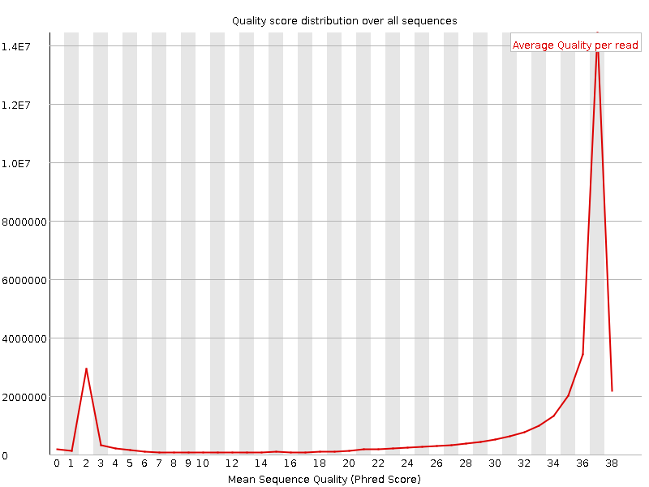|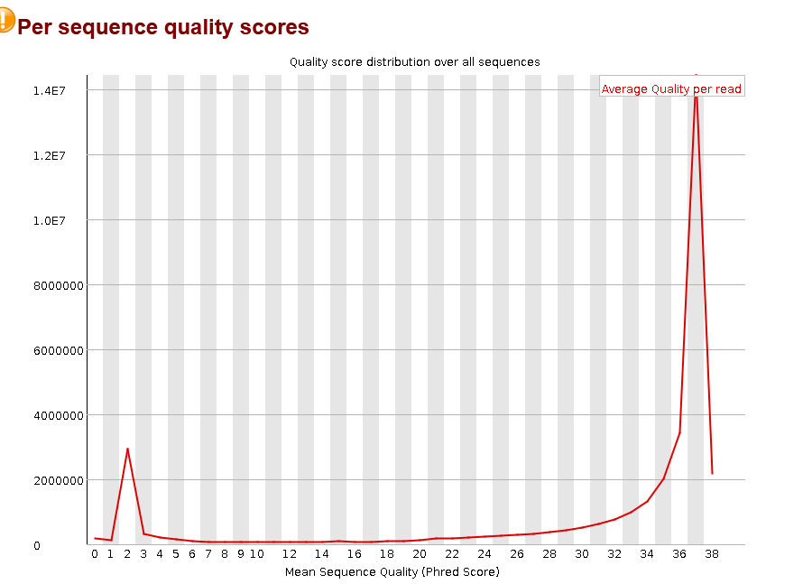|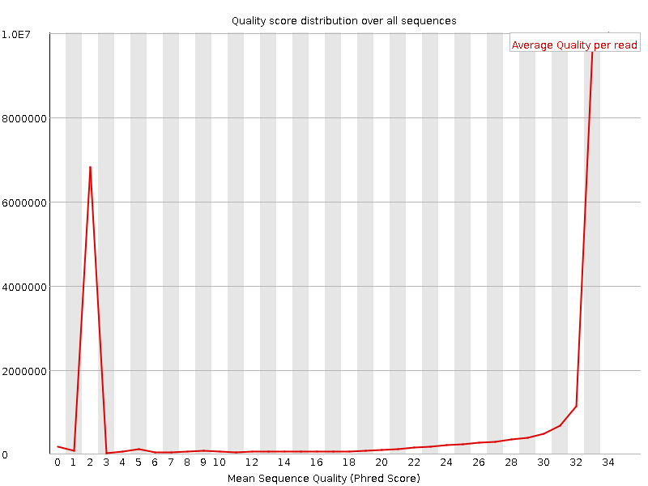|

Подрезание чтений и фильтрация не требуется, поскольку у ридов достаточно хорошее качество.

## Таблица со статистикой по выравниванию на 22 хромосому
|             |   Общее число ридов |   Выровнявшиеся уникально | Выровнявшиеся уникально (%)   |   Выровнявшиеся неуникально | Выровнявшиеся неуникально (%)   |   Не выровнявшиеся | Не выровнявшиеся (%)   |
|:------------|--------------------:|--------------------------:|:------------------------------|----------------------------:|:--------------------------------|-------------------:|:-----------------------|
| ENCFF387MHG |            34999379 |                   1264462 | 3.61%                         |                     5780645 | 16.52%                          |           27954272 | 79.87%                 |
| ENCFF449SLH |            64502139 |                   1302054 | 2.02%                         |                     4754625 | 7.37%                           |           58445460 | 90.61%                 |
| ENCFF003YFN |            32633277 |                    673738 | 2.06%                         |                     1726599 | 5.29%                           |           30232940 | 92.64%                 |

В отчете представлены результаты анализа качества ридов (FastQC), а также таблица со статистикой по выравниванию на хромосому 22. Однако, из-за того, что выравнивание проводилось только на одной хромосоме, процент несовпадений чтений больше, чем 79% для всех образцов.
## Диаграммы Венна

### 1 реплика и ENCODE
|1 реп. с ENCODE|ENCODE на 1 реп.|
|---|---|
|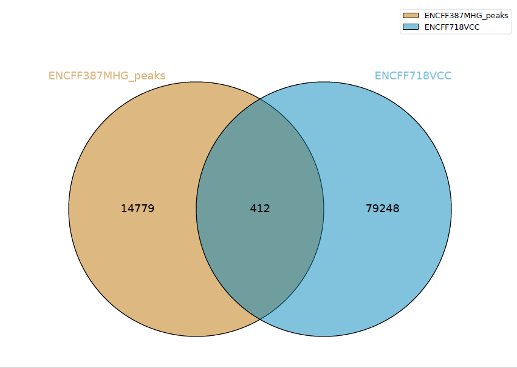|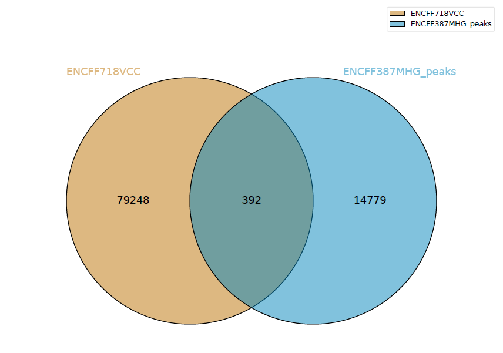|

### 2 реплика и ENCODE
|2 реп. с ENCODE|ENCODE на 2 реп.|
|---|---|
|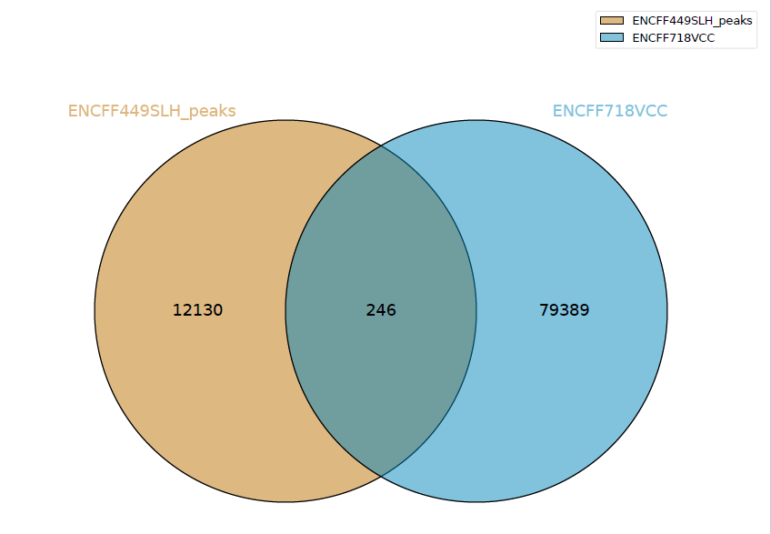|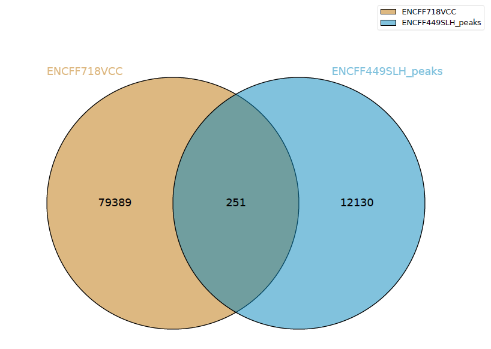|

Кроме того, представлены диаграммы Венна, показывающие количество пересечений между нашими пиками и пиками в базе данных ENCODE. Из-за того, что выравнивание производилось только на одной хромосоме, количество пиков небольшое, что приводит к небольшому количеству пересечений. Диаграмма Венна показывает, что наши пики составляют меньшую долю от общего количества пиков, поскольку в базе данных ENCODE выравнивание было проведено на всех хромосомах. Кроме того, порядок сравнения влияет на результат, что также отразилось на диаграмме.

